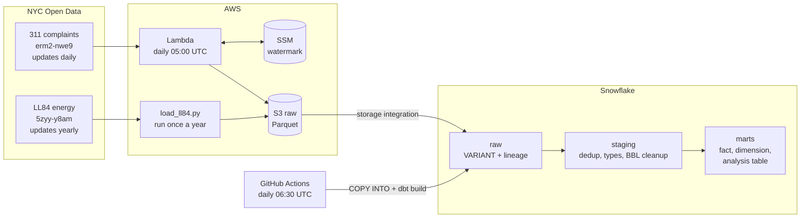

# HeatWatch NYC

**Do energy-inefficient apartment buildings leave their tenants cold?**

A daily pipeline that joins every NYC 311 heat complaint to the building's energy performance
from Local Law 84 benchmarking, so the question can be answered with data that refreshes itself.

**Short answer:** not as a general rule. Once building size and age are accounted for, the link
between Energy Star score and heat complaints holds only in prewar buildings. See [Findings](#findings).

## Architecture



| Layer | What it does | Where |
|---|---|---|
| Ingestion | Pulls 311 heat complaints changed since the last run, reconciled against the API's own row count | `ingestion/` (Lambda) |
| | One-time backfill by creation month, for complaints older than the first run | `ingestion/backfill_311.py` |
| | Pulls one Parquet file per LL84 report year | `ingestion/load_ll84.py` |
| Raw | Every file, untouched, with the file it came from | `snowflake/0*.sql` |
| Staging | One row per complaint and per property; types; LL84 BBLs normalized | `dbt/models/staging`, `intermediate` |
| Marts | Complaints fact, residential lot dimension, lot x heat-season analysis table | `dbt/models/marts` |
| Schedule | Load new files, rebuild, run 20 tests, check freshness | `.github/workflows/daily-dbt.yml` |
| Dashboard | Streamlit in Snowflake: trend, the Simpson's paradox, age split, worst lots, map | `dashboard/streamlit_app.py` |

## Design choices worth knowing

The full reasoning, with the evidence behind each decision, is in [docs/decisions.md](docs/decisions.md).

- **Incremental on `:updated_at`, not `created_date`.** Complaints change after they're filed
  (closed, resolved). The watermark only moves after a file is safely in S3, so a crash can
  cause a re-read but never a gap.
- **Reconcile, don't trust empty pages.** Two early runs silently stopped short and dropped
  ~211K rows. Extraction now asks the API for the expected count first, retries short pages,
  and refuses to write a partial load.
- **Check the dataset, not just each run.** Per-run reconciliation passed every day, yet a
  month-by-month comparison against the city found most of 2026 missing: incremental loads never
  see complaints closed before the pipeline started. A one-time backfill by `created_date` fixed it.
- **Raw keeps duplicates; staging removes them.** The city republishes nearly the whole dataset
  every ~2 days, so 1.1M raw rows hold 224K unique complaints. Staging keeps the latest version
  of each, across *all* files, because the newest file is not a full snapshot.
- **LL84's BBL field comes in six formats.** Clean, dashed, comma lists, semicolon lists,
  "Not Available", and EPA demo records. A naive join silently dropped 2.4 points of complaint
  matches. The normalization is unit-tested against each format.
- **Compare each complaint to the score that existed at the time.** A January 2026 complaint
  joins to 2024 LL84 data, the latest published then. Using a later score would be like judging
  an old stock pick with next year's prices.
- **Keep the zeros.** The analysis table starts from buildings and left-joins complaints, so
  buildings nobody complained about stay in as the control group.

## Findings

From [the exploration notebook](notebooks/01_explore_data.ipynb): January 2026 "no heat" complaints
against 2024 Energy Star scores, 16,719 residential lots with a score.

1. **Pooled, there's no clear pattern.** Complaint rates per 100K sq ft are similar across
   Energy Star bands (1.38 to 1.99).
2. **Size dominates.** The smallest quarter of lots gets 5.78 complaints per 100K sq ft; the
   largest gets 0.75, about 8x less.
3. **Within size groups, a pattern appears: Simpson's paradox.** In the smallest three
   quarters, the best-scoring buildings have 49%, 31% and 16% fewer complaints than the worst.
   In the largest quarter it reverses. The largest lots hold about two-thirds of all floor area,
   so they hid the pattern in the pooled comparison.
4. **Age matters even more, and the efficiency effect is a prewar effect.** Prewar buildings get
   4-8x more complaints per sq ft than newer ones. The efficiency pattern holds clearly only
   there (4.81 to 2.93 per 100K sq ft, worst band to best, 39% lower); from 1930 on, the least
   efficient buildings have the *fewest* complaints.
5. **Controlling for both at once** (Poisson regression with a floor-area offset and robust
   errors): each 10 Energy Star points goes with 1.7% fewer complaints (rate ratio 0.983,
   95% CI 0.965-1.002, p = 0.08). Not significant at the 5% level. Buildings from 1990 on get
   56% fewer complaints than prewar ones, the strongest effect in the model.

**Conclusion:** the hypothesis is not supported as a general rule. Energy efficiency tracks
tenant heat complaints in prewar buildings, where old heating systems and envelopes meet; in
newer buildings, age and size explain far more.

**Scope:** LL84 only covers large buildings. 42.5% of buildings with January heat complaints
match LL84, but they account for 61.1% of complaints. This is a story about large buildings.

The pipeline now rebuilds this comparison daily in `marts.mart_lot_heat_season`, for whole heat
seasons rather than one month. `dbt/analyses/notebook_check_jan_2026.sql` reproduces the
notebook's first table from the dbt models.

## Running it

**One-time setup** (details and evidence in [docs/decisions.md](docs/decisions.md)):

1. AWS: S3 bucket, the `heatwatch-ingest-311` Lambda with the policies in `infra/`, an SSM
   parameter `/heatwatch/311/watermark`, and an EventBridge schedule at 05:00 UTC.
2. Snowflake: run `snowflake/01` through `05` in order. `02` prints an external ID that goes
   into the AWS role's trust policy for `infra/snowflake-s3-read-policy.json`.
3. Key-pair auth for dbt: generate a key pair, attach the public key with
   `ALTER USER ... SET RSA_PUBLIC_KEY = '...'`, and keep the private key at
   `~/.snowflake/rsa_key.p8`.
4. GitHub: add repository secrets `SNOWFLAKE_ACCOUNT`, `SNOWFLAKE_USER` and
   `SNOWFLAKE_PRIVATE_KEY`.

**Day to day**, it runs itself: the Lambda at 05:00 UTC, dbt at 06:30 UTC.

**By hand:**

```bash
pip install -r requirements.txt
export SNOWFLAKE_ACCOUNT=... SNOWFLAKE_USER=...

python -m ingestion.run              # one 311 incremental load
python -m ingestion.backfill_311 2024-10   # one-time: every complaint created since a month
python -m ingestion.load_ll84 2025   # once a year, when the city publishes a new report year

cd dbt
dbt run-operation load_raw           # COPY new files from S3 into raw
dbt build                            # build and test every model
dbt source freshness                 # is the ingestion still delivering?
```

## Known limitations

- **Deleted complaints are never removed.** Incremental extraction can't see deletions. Not
  observed so far; the fix would be a periodic comparison against the city's current ID list.
- **Floor area is split evenly** across a property's lots, because LL84 doesn't say which building
  sits on which lot.
- **dbt runs as ACCOUNTADMIN.** Fine for a one-person project; a least-privilege role is the next
  step before sharing the account.
- **GitHub pauses scheduled workflows after 60 days without repository activity.** Re-enable it
  from the Actions tab if that happens.

## Repository layout

```
ingestion/          311 Lambda (run.py, extract_311.py, watermark.py, write_s3.py), backfill, LL84 loader
infra/              IAM policies for the Lambda and for Snowflake's read-only S3 access
snowflake/          one-time setup: warehouse, storage integration, stages, raw tables
dbt/                staging, intermediate and mart models, tests, load_raw macro
notebooks/          the exploration that shaped every decision above
dashboard/          Streamlit in Snowflake app reading the marts
docs/decisions.md   what was decided, when, and the evidence
```
